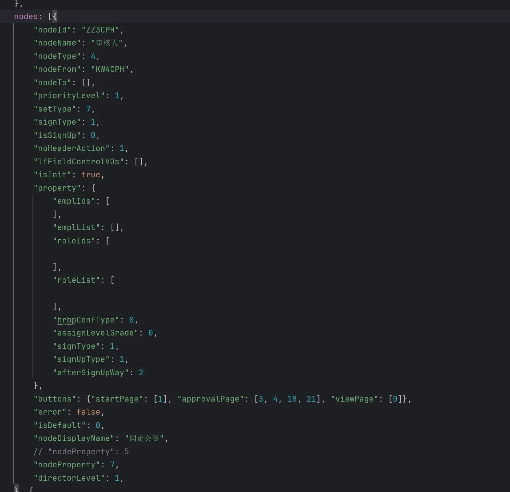

# 编写规则
在日常开发的页面中，尽量按照此规范写注释，方便维护，过于简单的内容可不加注释。  
开发公共代码 或者 通用库时，必须按照此规范执行。  

## 声明字段注释
> 规则：  
1：要在字段上方写好注释  
2：内容：  
  1）写明含义  
  2）未使用枚举时，要写明可使用的枚举值。（有不同状态时，应该是写枚举的。）  
  3）写明与其他字段的耦合关系（尤其在写组件库的文档时，关联关系要写清楚，如使用vant组件库的dialog组件时，按照文档增加了cancelButtonText属性，但是并没有展示出来取消按钮，原因是还需要加一个showCancelButton属性，不写清楚的话就要耗费大家的时间）  
3：原因：  
如下图，这个是流程图配置时候的一个节点，没有注释，每个字段都需要阅读代码查看，是什么含义？包含哪些值？和其他字段有什么耦合关系？非常不利于维护和扩展。项目中如果类似于这种功能比较多时，其他人开发或者交接，会耗费大量的时间梳理逻辑和规则，并且容易出bug。  
  


## 接口注释  
> 规则：写好含义及入参出参。  
函数标准注释展示如下：
```
/**  
*  
* @param 入参1 描述  
* @returns {} 返回信息  
  */  
```

## 特殊逻辑注释  
> 规则：特殊的逻辑必须加注释。  
原因：如果特殊逻辑不加注释，会让人非常难以理解。  
如后端要求，在传递某种类型的时候，需要做下转换，这种特殊处理的时候要加下注释。  

