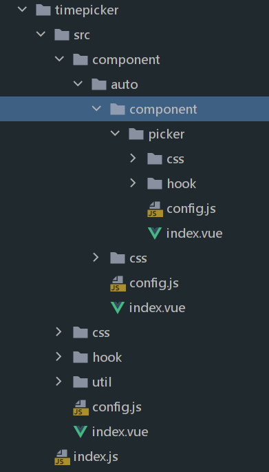

# 文件结构

## 说明
具体文件应该放置于单独的文件夹中，如对应的内容需放在对应的util、hook、component等文件夹中  
如果一个组件是由多个组件构成的，子组件需放在对应的component文件夹中，结构类似于套娃一样，有清晰的层级关系，这样可读性较强；  

## 文件含义

project  
│   env.dev 本地开发环境变量  
│   env.sit sit环境变量    
│   env.uat uat环境变量  
│   env.prod 生产包环境变量  
│   postcss.config.js scss支持  
│   stylelint.config.cjs css代码校验    
│   .stylelintignore 忽略校验的css文件    
│   eslint.config.mjs js、vue代码校验  
│   prettier.config.cjs 代码美化  
│   tsconfig.json ts规则校验      
│   vite.config.ts vite构建工具      
│   gitignore 忽略git上传文件    
│   index.html html入口    
│   package.json 项目公共依赖包  
│   README.md 介绍    
│
│
└─── src    
│
│  
│──────── api 接口请求     
│
│        
│──────── asset  
│&nbsp;&nbsp;&nbsp;&nbsp;&nbsp;&nbsp;&nbsp;&nbsp;&nbsp;&nbsp;&nbsp;&nbsp;&nbsp;&nbsp;&nbsp;&nbsp;&nbsp;&nbsp;&nbsp;&nbsp; 资源文件夹  
│&nbsp;&nbsp;&nbsp;&nbsp;&nbsp;&nbsp;&nbsp;&nbsp;&nbsp;&nbsp;&nbsp;&nbsp;&nbsp;&nbsp;&nbsp;&nbsp;&nbsp;&nbsp;&nbsp;&nbsp; font    
│&nbsp;&nbsp;&nbsp;&nbsp;&nbsp;&nbsp;&nbsp;&nbsp;&nbsp;&nbsp;&nbsp;&nbsp;&nbsp;&nbsp;&nbsp;&nbsp;&nbsp;&nbsp;&nbsp;&nbsp; image  
│&nbsp;&nbsp;&nbsp;&nbsp;&nbsp;&nbsp;&nbsp;&nbsp;&nbsp;&nbsp;&nbsp;&nbsp;&nbsp;&nbsp;&nbsp;&nbsp;&nbsp;&nbsp;&nbsp;&nbsp; svg              
│        
│──────── component 组件  
│                                                 
│            
└──────── constant  静态变量    
│                                             
│            
└──────── css       样式资源  
│                                             
│            
└──────── directive 指令  
│                                                
│            
└──────── hook      hook函数  
│                                          
│            
└──────── router    路由  
│                                              
│            
└──────── store     状态管理  
│                                            
│            
└──────── type      typescript类型  
│                                      
│            
└──────── util      工具函数  
│                                          
│            
└──────── view      视图  
│                                         
│            
└──────── app       视图入口  
│                                         
│            
└──────── main      逻辑入口  

