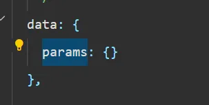
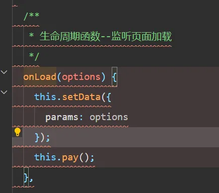
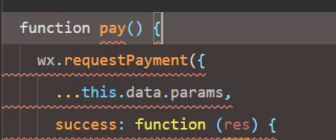
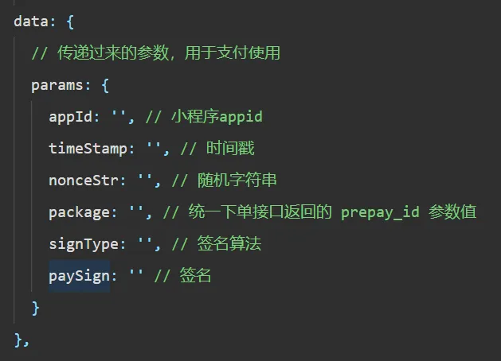
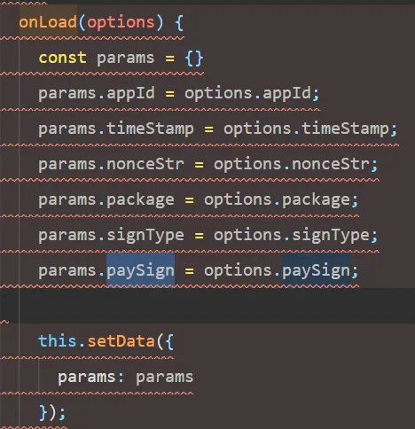
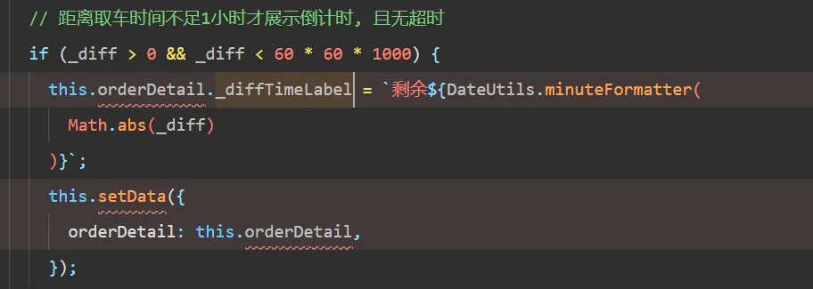
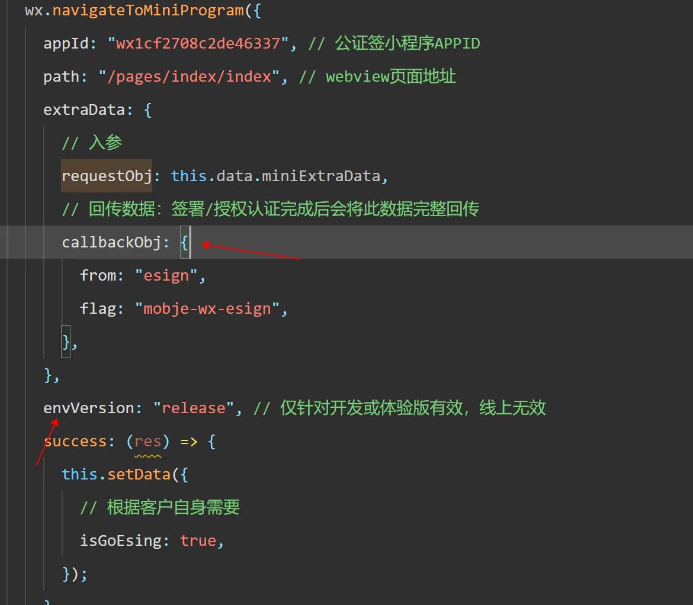

# 编写规范
此部分为平时开发自行总结的经验，能够减少开发问题，将不断总结记录

## 规则

> 规则：能用Es6的时候禁止用Es5。  
原因：  
Es6的代码更加精简。且能避免部分问题。  
  
> 规则：如果确定只有两种情况的时候是可以用三元运算符的，但是当条件大于两个，建议用if-else或者switch case  
原因：  
以逻辑清晰，方便扩展为主。

> 规则：编码应该使用两次编码，解码应该解码两次。  
原因：  
存在 传递内容时会自动解码/第三方库无法上传特殊字符 的情况，所以限定好编码和解码都要两次可以减少问题的出现。

> 规则：存在code等内容，其应该按照规则放置在全局文件中，后续的使用均使用同一个code  
原因：  
随着业务的扩展，硬编码的意义可能会改变，如果不适用统一的内容，改造会比较麻烦且可能出现疏漏。

> 规则：编写后的代码不能存在冗余代码。  
原因：  
如果功能大体相同，可以复制代码，但是要进行检查，多余的功能的代码要进行删减及调整。

> 规则：Url上面的参数内容需要放置在路由的meta字段中；解析放置于代码顶部  
原因：  
存在查看入参内容的情况，放置到meta中能够快速且清晰的标识出当前页面在什么情况需要传递什么参数。
相同的功能放置在一起，对于参数的解析最好都放置在代码顶部，代码更加清楚

> 规则：当存在可以return的情况，其内容应该放在代码的最上方  
原因：  
按照这种规则代码更加清晰

> 规则：当发送完信息后，需要有对应的成功/失败提示；要有对应的loading效果。  
原因：  
当用户进行操作后，当前操作的效果给与用户提示会更加友好。  
因为接口会有一定的网络延迟时间，否则用户可能会一直点击，进行多次操作，增加loading效果可以更加清晰，减少接口调用次数。

> 规则：初始化的内容放到生命周期中  
原因：  
不要在不同位置都有调用函数的内容，很不清晰，可以放到生命周期中，方便查看及调整。

> 规则：给组件传递参数时，需要哪些字段就传递哪些字段，不要把多余的字段都传进去  
原因：  
如组件需要两个参数：localLable、localValue，而后端返回的对象中，除了这两个字段，还有其它好多的字段。
直接将后端返回的内容传递进去是可以的，但是对于新接手项目的人而言，在组装组件参数的时候就会很困惑，甚至需要去查看组件源码才能知道自己需要传递哪些内容，在不断更换人员开发的过程中，就会耗费一定的阅读时间及沟通成本。

> 规则：对于某些功能的内容，尽量在固定的位置一次性处理好。  
原因：  
如某个页面，包含新建以及编辑功能，新建需要自己初始化数据，而编辑则会由后端返回数据，这时候，最好在页面入口处就根据规则把数据处理好，然后下发到各个组件中，否则组件的层级很深，都在自己需要的位置进行初始化，容易引起误解。


> 规则：能用常量的地方要使用常量。  
原因：  
如弹窗有新增和编辑两种，新增可能写成add，也可能写成ADD，通过使用常量能够避免问题  


> 规则：函数参数尽量为对象  
原因：  
当不用对象，并且参数为多个内容的时候，当最后几个参数均未缺省值并且类型不确定时，无法处理  


> 规则：跳转传参时尽量传递id，不要把所有内容传递过去  
原因：  
浏览器对url传递的内容大小有限制，当需要传递的内容的数据量很大时，无法传递全部数据。Get请求也存在这种问题。  


> 规则：尽量使用字符串而非数字  
原因：  
如商户号可以为数字，但是通过url传递参数后，拿到的默认为字符串，不做处理很容易导致上传错误。如果数字位数不一致，传递字符串不会忽略前面的0，可以保证位数相等。  


> 规则：空数组为[]，空对象为null，空字符串为""，空数字为NaN，Boolean只有true和false  
原因：  
如空数组为null，前端在遍历的时候需要进行是否为空值的判断，漏掉会出问题。  


> 规则：声明入参时要明确字段    
原因：  
对于外部传过来的url参数，赋值时，要在声明的地方写清楚有哪些字段，而不是直接把一个对象的引用赋值过去。否则，在后续进行开发和维护的过程中，在需要使用某个字段的时候，就无能明确的知道这个对象是否有所需的字段，类型是否一致。迭代开发时，无论是自己或者其他人来维护的时候，就有点麻烦。   
如下：如果直接这样给接口传值，可能因为参数内容不对应，无法正常调用接口。  
  
  
  
而像下面这么写，内容一目了然，options使用范围也很清晰，扩展和维护的时候就会非常方便  
  



> 规则：接口返回的数据，不要在结构中增加新的内容  
原因：  
返回值就是返回值，如果需要加工，应该放在其他的结构中，这样逻辑更为清楚。  
下面的代码中，orderDetail是接口返回的详情数据，这样写就非常不好。    
  


> 规则：不变的内容不要声明在变量中  
原因：  
固定的内容声明为变量，会增加阅读的工作量。  
如下面指出的内容，直接固定写好即可，不要声明为变量。    



> 规则：一个数据的处理放在一起，不要在上面处理一下，下面又处理一下  
原因：  
数据放在同一个位置统一处理更加可读。  
如下，discountWalletRef这个数据就放在了两个不同的部分进行了处理，阅读起来就不是很流畅。
``` 
优化前：
async function clickconfirm() {
  isUseWalletRef.value = !isUseWalletRef.value;

  let unpaidAmount = 0;

  if (!isUseWalletRef.value) {
    discountWalletRef.value = 0
    isUseWalletRef.value = false;
  } else {
    unpaidAmount = detailRef.value.unpaidAmount;
    isUseWalletRef.value = true;
  }

  await getDetailData();

  if (isUseWalletRef.value) {
    if (detailRef.value.accountAmount > unpaidAmount) {
      discountWalletRef.value = unpaidAmount;
    } else {
      discountWalletRef.value = detailRef.value.accountAmount;
    }
  }
}
```优化后：
async function clickconfirm() {
  isUseWalletRef.value = !isUseWalletRef.value;

  let unpaidAmount = 0;

  if (!isUseWalletRef.value) {
    isUseWalletRef.value = false;
  } else {
    unpaidAmount = detailRef.value.unpaidAmount;
    isUseWalletRef.value = true;
  }

  await getDetailData();

  if (isUseWalletRef.value) {
    if (detailRef.value.accountAmount > unpaidAmount) {
      discountWalletRef.value = unpaidAmount;
    } else {
      discountWalletRef.value = detailRef.value.accountAmount;
    }
  } else {
    discountWalletRef.value = 0
  }
}
```


> 规则：一个字段只表示一种含义，不要耦合其他的含义  
原因：  
一个状态表示多种含义，在业务扩展时，很可能需要增加新值，否则无法表示出全部状态，并且逻辑很不清楚。非常不利于扩展和维护。  
如下面的订单状态和支付状态，支付状态中耦合了订单状态的内容。导致支付状态字段很多，使用起来比较麻烦，逻辑不清晰。
``` 代码
/**
* 订单状态
* @type {{BOOK: 预定待支付, ALLOCATED: 已分配车辆, PICK_UP: 已取车, FINISH: 已完成, RETURN: 已还车, CANCELLED: 已取消}}
  */

/**
* 订单支付状态
* @type {{CANCELED_UNPAID: 预约未支付,
* BOOK_UNPAID: 预定待支付,
* BOOK_PAID:预约已支付,
* BOOK_NEED_REFUND: 预定待退款,
* BOOK_REFUNDING: 预约退款中,
* BOOK_REFUND_FAILED: 预约退款失败
* BOOK_REFUND: 预约已退款
* FINISH_NEED_EXTRA: 最终待支付
* FINISH_UNPAID: 最终待支付
* FINISH_NEED_REFUND: 最终待退款
* FINISH_REFUNDING：最终退款中
* FINISH_REFUND_FAILED：最终退款失败
* FINISH_PAID：最终已支付
* FINISH_REFUND：最终已退款
* }}
  */  
* 
```
